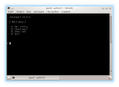
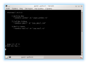
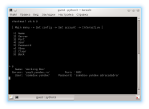
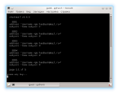
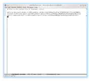

[<- Back](./)

## checkmail
[Go to the project](https://github.com/freeprogs/checkmail)

#### Description

Checks mail for incoming messages.

If some mail has come it prints number of messages in the box and some
message headers like sender address and subject.

#### Example

1) You run the program and see the main window. Here you can go inside menu items to operate with mail boxes.

2) When you have mail boxes in the file, you can view all of them to select any by its number.

3) After you have selected a mail box you can view its data and edit them. In the same menu item you can create a new mail box and check it or save to the file.

4) After you have selected the mail box you can check mail in it. For 5 messages it works well, but also for 1000 messages it works well too.

5) To know that your data are secured well you can look into the .checkmail-account file in your home directory. This file you can edit through the program or by yourself in a text editor.

