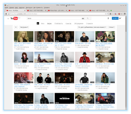
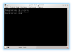
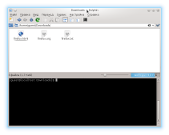
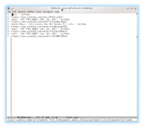
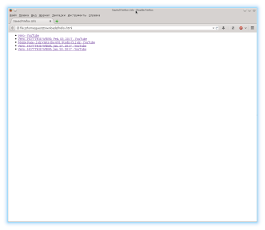
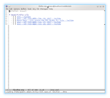

# Programs

### ffurls

Saves tabs opened in Firefox to a file in some format.

It takes Firefox file with actual configuration of opened tabs and
windows, finds titles and urls there and saves these pairs to a file
in a selected format.

#### Example

1) You have opened tabs, but you want to watch them after some work.

2) You open a console and run one of shell-scripts or the default shell-script.

3) Then after some work you open the Downloads folder.

4) You open the file with saved tabs.

Text format.

Html format.

Emacs-org format.

Now you can open this tabs again and edit files for watched links.

---

You can save tabs many times (new files will increment names) and rename output files to more convenient names.
